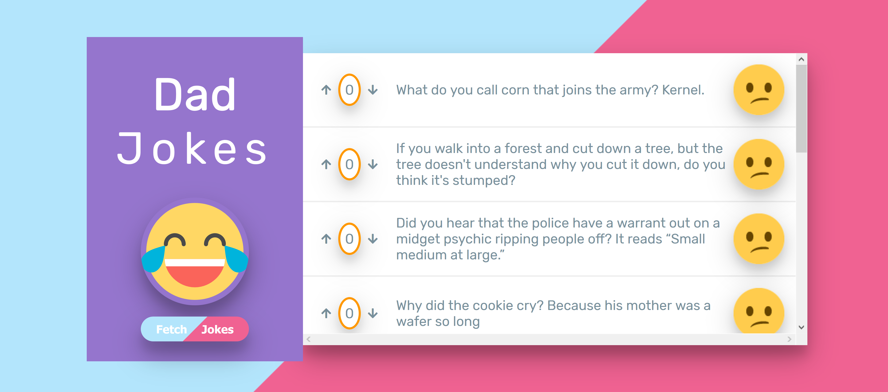

# Dad Jokes - React

##### Deployed App:

https://ksentak.github.io/dad-jokes-react/

---

---

##### App Description:

This is a react application that fetches jokes from the icanhazdadjoke API and then displays the jokes. When the user likes/dislikes jokes, the jokes are automatically sorted and emoji and colors are dynamically updated depending on how many votes a joke has received. Clicking the fetch jokes button adds ten jokes to the joke list.

---

##### Technologies Used:

- React
- Typescript
- Axios
- CSS
- Emoji CSS
- FontAwesome
